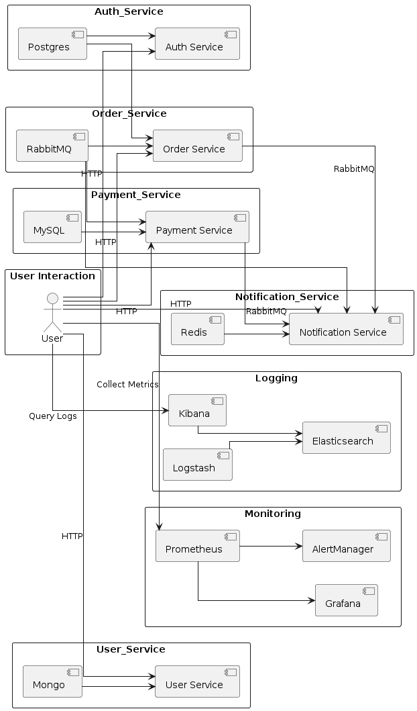

# Distributed System Microservices

This repository contains a collection of microservices that form a distributed system architecture. The project is designed for educational purposes and is currently a Work In Progress (WIP). The services included in this project demonstrate the usage of various technologies and patterns in building a scalable and resilient distributed system.

## Overview

The system is composed of the following microservices:

- **Auth Service**: Manages authentication and authorization.
- **User Service**: Handles user-related operations.
- **Order Service**: Manages order processing.
- **Payment Service**: Processes payments.
- **Notification Service**: Sends notifications to users.
- **Logging**: Centralized logging with Elasticsearch, Logstash, and Kibana (ELK stack).
- **Monitoring**: System monitoring with Prometheus, Grafana, and AlertManager.
- **Messaging**: Messaging infrastructure with RabbitMQ and Kafka.

## Architecture

The services communicate with each other using HTTP for synchronous calls and RabbitMQ/Kafka for asynchronous messaging. The system also includes centralized logging and monitoring to ensure observability and maintainability.



## Services

### Auth Service

- **Port**: 5000
- **Dependencies**: Postgres
- **Description**: Manages user authentication and authorization.
- **Technologies**: FastAPI, Postgres

### User Service

- **Port**: 5001
- **Dependencies**: Mongo, RabbitMQ
- **Description**: Handles user-related operations.
- **Technologies**: FastAPI, MongoDB

### Order Service

- **Port**: 5002
- **Dependencies**: Postgres, RabbitMQ
- **Description**: Manages order processing.
- **Technologies**: FastAPI, Postgres, RabbitMQ

### Payment Service

- **Port**: 5003
- **Dependencies**: MySQL, RabbitMQ
- **Description**: Processes payments.
- **Technologies**: FastAPI, MySQL, RabbitMQ

### Notification Service

- **Port**: 5004
- **Dependencies**: Redis, RabbitMQ
- **Description**: Sends notifications to users.
- **Technologies**: FastAPI, Redis, RabbitMQ

### Logging

- **Elasticsearch**: Stores and indexes logs.
- **Logstash**: Processes and sends logs to Elasticsearch.
- **Kibana**: Visualizes logs from Elasticsearch.

### Monitoring

- **Prometheus**: Collects and stores metrics.
- **Grafana**: Visualizes metrics from Prometheus.
- **AlertManager**: Sends alerts based on Prometheus metrics.

### Messaging

- **RabbitMQ**: Asynchronous messaging between services.
- **Kafka**: Distributed streaming platform for messaging.

## Getting Started

### Prerequisites

- Docker and Docker Compose
- Basic understanding of microservices architecture

### Installation

1. Clone the repository:

   ```bash
   git clone https://github.com/yourusername/distributed-system-microservices.git
   cd distributed-system-microservices
   ```

2. Start the services using Docker Compose:

   ```bash
   docker-compose up --build
   ```

3. Access the services via the following URLs:
   - **Auth Service**: http://localhost:5000
   - **User Service**: http://localhost:5001
   - **Order Service**: http://localhost:5002
   - **Payment Service**: http://localhost:5003
   - **Notification Service**: http://localhost:5004
   - **Kibana**: http://localhost:5601
   - **Prometheus**: http://localhost:9090
   - **Grafana**: http://localhost:3001

### Usage

Each service exposes a REST API for interacting with the system. Refer to the individual service documentation for API endpoints and usage examples.

### Contributing

Contributions are welcome! Please submit a pull request or open an issue to discuss any changes.

### License

This project is licensed under the MIT License. See the LICENSE file for more details.

### Acknowledgements

- The project structure and concepts are inspired by various online resources and tutorials on microservices architecture.

### Disclaimer

This project is for educational purposes only and is currently a Work In Progress (WIP). It is not suitable for production use.
